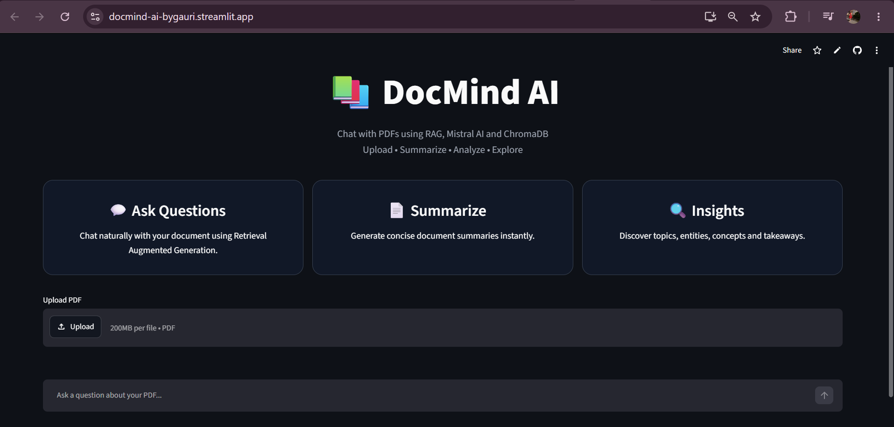
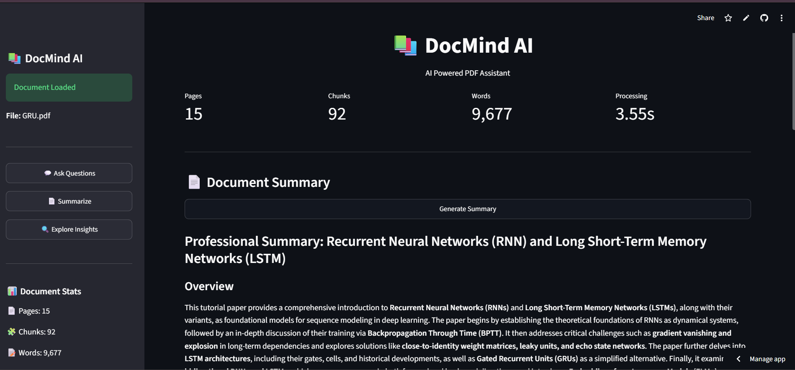
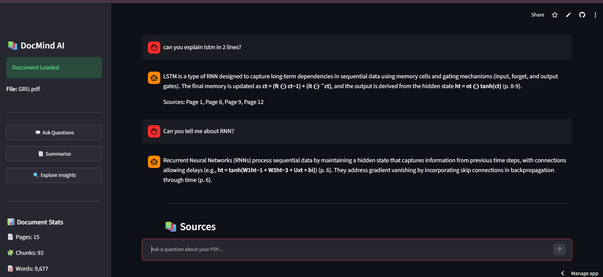

# 📄 DocMind AI


An AI-powered PDF Assistant built using **LangChain**, **Mistral AI**, **HuggingFace Embeddings**, **ChromaDB**, and **Streamlit**.

Upload any PDF and interact with it using Retrieval-Augmented Generation (RAG). Generate summaries, ask questions, and discover key insights from your documents.

---
## 🚀 Live Demo

👉 **[Launch DocMind AI](https://docmind-ai-bygauri.streamlit.app/)**

## 📸 Application Screenshots

### Home Page


### Document Summary


### Ask Questions


---

## ✨ Features

- 📄 Upload PDF documents
- 🤖 Ask questions about the document
- 📝 Generate AI-powered summaries
- 🔍 Extract key insights and concepts
- 🧠 Retrieval-Augmented Generation (RAG)
- ⚡ Fast semantic search using ChromaDB
- 🌐 Deployed on Streamlit Cloud

---

## 🛠️ Tech Stack

### Frontend
- Streamlit

### LLM
- Mistral AI

### Framework
- LangChain

### Embeddings
- HuggingFace Sentence Transformers
  - `all-MiniLM-L6-v2`

### Vector Database
- ChromaDB

### PDF Processing
- PyPDFLoader
- RecursiveCharacterTextSplitter

---

# 📌 How It Works

## Phase 1: Document Processing

```text
PDF
 │
 ▼
Document Loader
 │
 ▼
Text Splitter
 │
 ▼
Text Chunks
 │
 ▼
HuggingFace Embeddings
 │
 ▼
Chroma Vector Store
```

### Step-by-Step

1. User uploads a PDF.
2. LangChain loads the document.
3. Text is split into smaller chunks.
4. Each chunk is converted into embeddings.
5. Embeddings are stored in ChromaDB.

---

## Phase 2: Retrieval-Augmented Generation (RAG)

```text
User Query
    │
    ▼
Query Embedding
    │
    ▼
Retriever
    │
    ▼
Relevant Chunks
    │
    ▼
Prompt + Context
    │
    ▼
Mistral AI
    │
    ▼
Final Answer
```

### Step-by-Step

1. User asks a question.
2. Query is converted into an embedding.
3. ChromaDB retrieves the most relevant chunks.
4. Retrieved context is combined with the user query.
5. Mistral AI generates an accurate answer grounded in the document.

---

## 📂 Project Structure

```text
DocMind-AI/
│
├── finalApp.py
├── create_database.py
├── document_loaders/
├── retrievers/
├── vectorStore/
├── requirements.txt
├── README.md
└── .env
```

---

## ⚙️ Installation

### Clone Repository

```bash
git clone https://github.com/gaurisoni2027/docmind-ai.git
cd docmind-ai
```

### Create Virtual Environment

```bash
python -m venv .venv
```

### Activate Environment

```bash
# Windows
.venv\Scripts\activate

# Linux/Mac
source .venv/bin/activate
```

### Install Dependencies

```bash
pip install -r requirements.txt
```

---

## 🔑 Environment Variables

Create a `.env` file:

```env
MISTRAL_API_KEY=your_api_key_here
```

---

## ▶️ Run Locally

```bash
streamlit run finalApp.py
```

---

## 📸 Application Preview

### Upload PDF
- Upload any PDF document.

### Ask Questions
- Chat with your PDF using RAG.

### Generate Summary
- Generate concise document summaries.

### Explore Insights
- Discover key concepts and important topics.

---

## 🎯 Future Enhancements

- Multi-PDF Chat
- Conversation Memory
- Citation-based Responses
- PDF Highlighting
- Source Attribution
- User Authentication

---
## 🌐 Deployment

The application is deployed on Streamlit Cloud and can be accessed here:

👉 https://docmind-ai-bygauri.streamlit.app/

## 👩‍💻 Author

**Gauri Soni**

B.Tech CSE Student 

GitHub: https://github.com/gaurisoni2027

---

⭐ If you found this project useful, consider giving it a star!